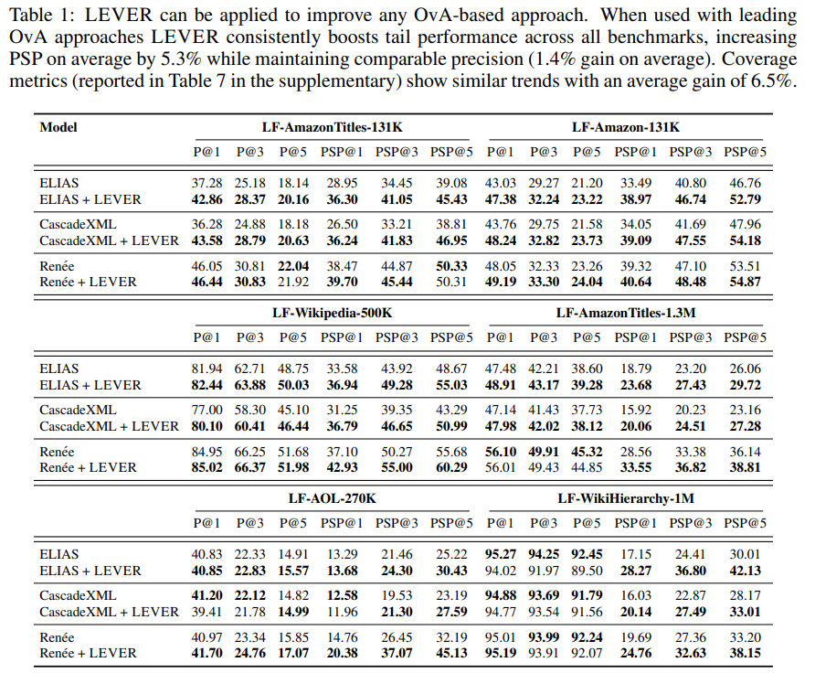

# LEVER: Enhancing Tail Performance In Extreme Classifiers by Label Variance Reduction


This is the official codebase for [ICLR 2024](https://iclr.cc/Conferences/2024) paper [ Enhancing Tail Performance In Extreme Classifiers by Label Variance Reduction](https://openreview.net/forum?id=6ARlSgun7J)

## Overview

Extreme Classification ([`XC`](http://manikvarma.org/downloads/XC/XMLRepository.html)) architectures, which utilize a massive one-vs-all classifier layer at the output, have demonstrated remarkable performance on problems with large label sets. However, these architectures are inaccurate on tail labels with few representative samples. This work explores the impact of label variance, a previously unexamined factor, on the tail performance
in extreme classifiers. It presents a method to systematically reduce label variance in XC by effectively utilizing the capabilities of an additional, tail-robust teacher model. It proposes a principled knowledge distillation framework, LEVER, which enhances tail performance in extreme classifiers with formal guarantees on generalization. Comprehensive experiments show that LEVER can enhance tail performance by around 5% and 6% points in PSP and coverage metrics, respectively, when combined with leading extreme classifiers. Moreover, it establishes a new state-of-
the-art when added to the top-performing [Ren ́ee](https://github.com/microsoft/renee) classifier.

Additionally, this work also contributed 2 new datasets which are representative of real world tasks of query auto-completion ([LF-AOL-270K](Datasets/AOL/)) and taxonomy-completion ([LF-WikiHierarchy-1M](Datasets/WikiHierarchy/))

## Environment Setup
To setup a conda environment run `bash Code/env_setup.sh`

## Running the Code

Training LEVER involves 2 steps 

### Stage 1: Training the tail-robust teacher model
Refer to the instructions [here](Code/TailTeacher/README.md)

### Stage 2: Training the extreme-classifier using the tail-robust teacher
Refer to the instructions [here](Code/ExtremeClassifier/README.md)

## Results

LEVER when combined with leading extreme classifiers such as [ELIAS](https://proceedings.neurips.cc/paper_files/paper/2022/file/7d4f98f916494121aca3da02e36a4d18-Paper-Conference.pdf), [CascadeXML](https://proceedings.neurips.cc/paper_files/paper/2022/file/0e0157ce5ea15831072be4744cbd5334-Paper-Conference.pdf), and [Renee](https://proceedings.mlsys.org/paper_files/paper/2023/file/3d8edd573b5b21fede5d98ecee0f6382-Paper-mlsys2023.pdf) results in significant performance improvement in both Precision and Propensity Weighted Precision metrics




## Cite

```bib
@inproceedings{
buvanesh2024enhancing,
title={Enhancing Tail Performance in Extreme Classifiers by Label Variance Reduction},
author={Anirudh Buvanesh and Rahul Chand and Jatin Prakash and Bhawna Paliwal and Mudit Dhawan and Neelabh Madan and Deepesh Hada and Vidit Jain and Sonu Mehta and Yashoteja Prabhu and Manish Gupta and Ramachandran Ramjee and Manik Varma},
booktitle={The Twelfth International Conference on Learning Representations},
year={2024},
url={https://openreview.net/forum?id=6ARlSgun7J}
}
```

## You May Also Like
- [Renee: End-to-end training of extreme classification models](https://github.com/microsoft/renee)
- [DEXA: Deep Encoders with Auxiliary Parameters for Extreme Classification](https://github.com/Extreme-classification/dexa)
- [NGAME: Negative mining-aware mini-batching for extreme classification](https://github.com/Extreme-classification/ngame)
